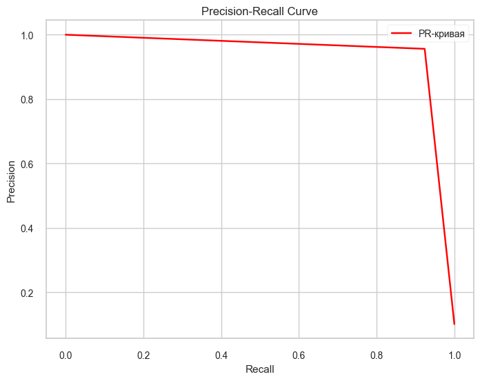
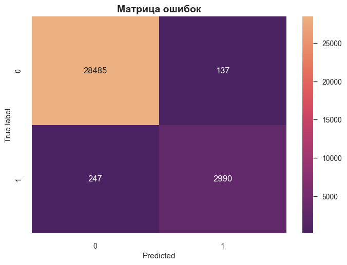

# ПРОЕКТ: КЛАССИФИКАЦИЯ КОММЕНТАРИЕВ

## Описание проекта

Интернет-магазин «Викишоп» запускает новый сервис. Теперь пользователи могут редактировать и дополнять описания товаров, как в вики-сообществах. То есть клиенты предлагают свои правки и комментируют изменения других. Магазину нужен инструмент, который будет искать токсичные комментарии и отправлять их на модерацию. 

## Задача проекта

Построить модель для классификации комментариев на *токсичные и нет* (задача бинарной классификации) со значением метрики качества *F1* не меньше 0.75.

## Исходные данные

Набор данных с разметкой о токсичности правок. Данные находятся в файле `toxic_comments.csv`. Столбец *text* в нём содержит текст комментария, а *toxic* — целевой признак (1 - токсичный комментарий, 0 - не токсичный).

# ЧТО БЫЛО СДЕЛАНО

1. Загружены данные.
2. Проведена их проверка на пропуски и дубликаты.
3. Проанализировано распределение целевой переменной.
4. Набор данных разделен на обучающую, тестовую и валидационную выборки.
5. Обучена модель __LogicticRegression__ с различными вариантами кодирования текстов:

- __TF-IDF__
- __spaCy__
- __BERT embeddings__

6. Получены пронозы на предобученной модели __BERT (*unitary/toxic-bert*)__, которая показала лучший результат.
7. Проведено тестирование лучшей модели на тестовой выборке и анализ метрик исходя из задачи бизнеса.

# ОЦЕНКА РЕЗУЛЬТАТОВ В КОНТЕКСТЕ БИЗНЕС-ЗАДАЧИ

__Бизнес-цель__ – максимально выявлять токсичные комментарии, поэтому ключевая метрика – Recall (чтобы находить как можно больше токсичных сообщений).

__Интерпретация метрик:__

1. __F1-score = 0.940__ – общий баланс между точностью (Precision) и полнотой (Recall). Очень высокий показатель.

2. __Precision = 0.956__ – из всех комментариев, которые предсказаны как токсичные __95.6% действительно токсичны__. Это значит, что если модель говорит, что комментарий токсичен, то она ошибается в 4.4% случаев.

3. __Recall = 0.924__ – из всех реально токсичных комментариев модель "поймала" __92.4%__. Это означает, что модель пропускает 7.6% токсичных комментариев.

	
4. __Матрица ошибок:__

- TP (True Positive) — в 2990 случаях из 3237 модель правильно решила, что комментарий негативный.
- FP (False Positive) — в 247 из 3237 случаях модель ошибочно решила, что комментарий негативный.
- FN (False Negative) — в 137 случаях из 28622 модель ошибочно решила, что комментарий позитивный.
- TN (True Negative) — в 28485 случаях из 28622 модель правильно решила, что комментарий позитивный.

### Возможные улучшения

Увеличение Precision (уменьшение ложноположительных срабатываний):

- использование Threshold Tuning – подбор оптимального порога вероятности для предсказаний
- применение более сложных моделей (например, BERT с дообучением)